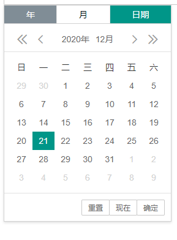

# laydateTab

## 介绍
基于layui的laydate实现的日期时间选择组件选项卡，可以支持多个日期类型切换选择，且对于laydate的配置全部支持。 [查看例子展示](https://xumisky.gitee.io/laydate-tab/)   


## 安装教程
依赖laydate，所以必须引用laydate!  
插件目录一定为以下结构：
```javascript
|-- extends  
	|-- css
		|-- laydateTab.css
	|-- laydateTab.js
```

### 1. 使用layui模块化引入
项目目录结构假设为：
```javascript
|-- project
	|-- js
		|-- layui
			|-- css
				|-- layui.css
			|-- extends
				|-- css
					|-- laydateTab.css
				|-- laydateTab.js
			|-- lay
				...
			|-- font
				...
			|-- images
				...
			|-- layui.all.js
			|-- layui.js
```
**则引用方式为：**  
1.  先加载layui相关的js、css
2.  模块加载代码如下  
```javascript  
layui.config({  
		base: 'js/layui/extends/'
}).extend({ 
		laydateTab: 'laydateTab' 
}).use(['laydateTab'], function(){
		var laydateTab = layui.laydateTab;
});
```

### 2. 使用laydate单独引入
项目目录结构假设为：
```javascript
|-- project
	|-- js
		|-- laydate
			|-- laydate.js
			|-- theme
				|-- default
						...
					|-- laydate.css
		|-- extends
			|-- css
				|-- laydateTab.css
			|-- laydateTab.js
```
**则引用方式为：**  
```javascript
<script src="js/laydate/laydate.js" type="text/javascript" charset="utf-8"></script>
<script src="js/extends/laydateTab.js" type="text/javascript" charset="utf-8"></script>
```
## 使用说明
### 获取laydateTab对象 
1.  使用layui模块化引入，使用``layui.laydateTab``获取laydateTab对象。  
```javascript
layui.config({
		base: 'js/layui/extends/' //假设这是你存放拓展模块的根目录
}).extend({ //设定laydateTab模块别名
		laydateTab: 'laydateTab' 
}).use(['laydateTab'], function(){
		var laydateTab = layui.laydateTab;
		laydateTab.render({
				elem : '#indate'
		});
});
```
2.  使用laydate模块单独引入，使用``laydateTab``获取laydateTab对象。  
```javascript
laydateTab.render({  
		elem : '#indate'
});
```

3.  具体例子参考 **examples** 文件夹里面。
**最简单的绑定配置**
```javascript
laydateTab.render({
	elem : '#indate' // 绑定触发元素
});
```
**比较复杂的绑定配置**
```javascript
laydateTab.render({
	elem : '#indate', // 绑定触发元素
	type : ['year', 'month'], //显示的类型选项卡
	title : ['年份', '月份'], // 日期选择选项卡显示的标题名称
	range : '~', // 开启范围，使用Array则对类型区分使用该参数
	selected : 'month', // 初始化默认显示的选项卡
	theme : '#393D49', //主题
	// 渲染成功之后回调
	success : function(tabElem, options) {
	    console.log(tabElem); // 日期选项卡对应的标签元素
	    console.log(options); // 渲染的参数
	},
	// 切换选项卡的回调
	changeTab : function(type, title) { 
		console.log(type); // 当前选择的类型
		console.log(title); // 当前选择的类型标题名称
	},
	// 选择完毕的回调, 可参考laydate done回调
	done : function(value, date, endDate) {
		console.log(value); // 生成的值(选择后的值)
		console.log(date); // 日期时间对象
		console.log(date); //结束的日期时间对象
	    layer.msg('当前选择的值为:<br> ' + value);
	},
	// 销毁选项卡之后的回调
	end : function(elem) {
	    console.log(elem); // 所绑定的触发元素 - elem对象 
	}
});
```

### laydateTab特有的相关配置

|参数	|类型	|说明	|示例值		|
---|---|---|---
elem | String/DOM | 指定laydateTab的触发的元素，必填 | '#demo'
trigger | String | 触发显示laydateTab的事件，默认值：click | 'mouseover'
type | Array / String | 需要渲染的选项卡类型。<br>1.  默认值: ['year', 'month', 'date'] <br> 2.   选项卡类型值：<br> year : 年 <br> month : 月 <br> date : 日期 <br> time : 时间 <br> datetime : 日期时间 <br>3.  内置String快捷类型：<br> yms : 年、月、日期3个选项卡 <br>ym : 年、月2个选项卡 <br>md : 月、日期2个选项卡<br>all : 年、月、日期、时间、日期时间全部5个选项卡 | 'yms' <br> [year', 'month', 'date']
title |  Array | [选填]日期选择选项卡显示的标题名称，如果填写，则使用数组写出和type对应的选项卡标题名称，如果数组中某个值为null，则使用内置默认值。<br>默认值如下：<br>year: 年<br>month: 月<br>date: 日期<br>datetime: 日期时间<br>time: 时间 | ['年份', '月份', '日期']
value |  Array / String | 日期默认值,使用数组则需要和type一一对应。 | '2020-12-01'
selected |  String | 初始化默认显示的选项卡。 | 'date'
theme | String | 主题；theme的可选值有：default（默认简约）、molv（墨绿背景）、#颜色值（自定义颜色背景）、grid（格子主题）| '#393D49'
locationValueTab | Boolean | 有初始值情况下，是否定位到初始值对应的选项卡类型,默认true，false不进行定位 | false
success | Function | 渲染显示成功之后的回调，返回2个参数，分别为日期选项卡对应的标签元素、渲染配置 | function(tabElem, options)  {<br> console.log(tabElem);<br>console.log(options);<br>}
changeTab | Function | 切换选项卡的回调，返回1个参数-选项卡对应的类型、类型标题名称 | function(type, title)  {<br> console.log(type);<br> console.log(title);<br>}
done | Array / Function | 选择完毕的回调,如果是数组，则数组存放的也需要为function，可参考laydate done回调;回调参数带有3个参数分别代表：生成的值、日期时间对象、结束的日期时间对象；如果return String类型的值回去，则将return的值给elem赋值<br> | function(value, date, endDate){<br>console.log(value);<br>console.log(date);<br>console.log(endDate);<br>}
end | Function | 销毁选项卡之后的回调，返回1个参数-所绑定的elem对象 | function(elem)  {<br> console.log(elem);<br>}

*tips : `position`参数不可使用*

### 其他相关配置

其他配置参考[laydate配置](https://www.layui.com/doc/modules/laydate.html#onchange), 选项卡全通用则使用**单个值**，区分选项卡则使用**数组**。


## 参与贡献

1.  Fork 本仓库
2.  新建 Feat_xxx 分支
3.  提交代码
4.  新建 Pull Request  
